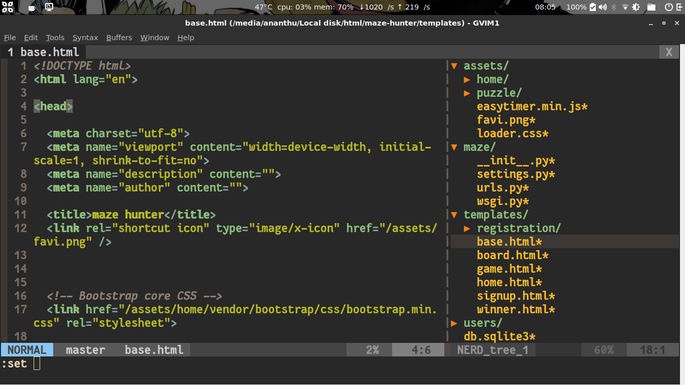
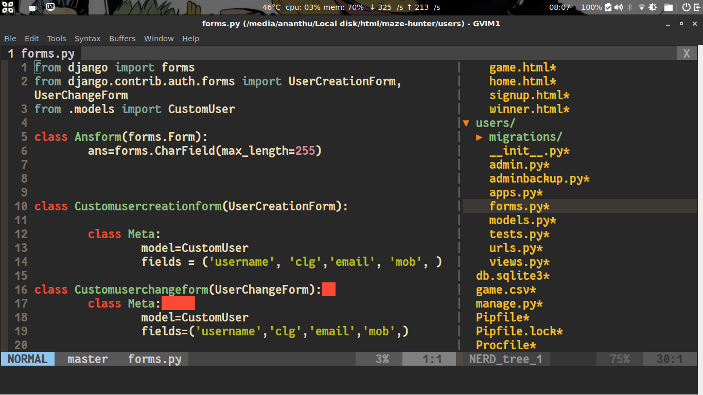

# vim-configs
-------

## vimrc and plugins

## HTML

## PYTHON

This repo provides extra features for vim.For the base vimrc configs go to https://github.com/amix/vimrc and follow the installation.

After the basic config, then add the my_configs.vim file to the ~/.vim_runtime directory.

Replace the directory ~/.vim_runtime/my_plugins with my_plugins in this repo.

-----------

# Included Plugins in this repo 

1. vim - dracula colour scheme
2. vim-colors-solarized - solarized colour scheme
3. gruvbox - default, this is my favourite colour scheme.
4. Vundle - Plugin manager

### fonts should be added separatively see https://github.com/ask1234560/fantasque-sans for installation

